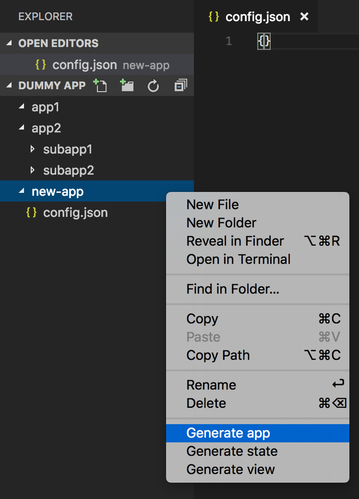

# Generator App

## Right click the folder where you want to generate your new app, component, or state. Click on the menu item that corresponds to what you want to do: [Generate app, Generate view, Generate state] ##

## Terminal will come up with prompts you need to fill in about your new app, component, or state. After which your new app will be generated ##

## Enjoy! ##
